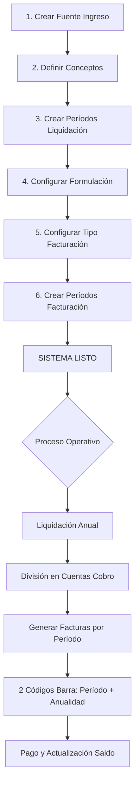

# 📋 Guía Completa: Sistema de Liquidación y Facturación

## 🎯 Flujo de Configuración

### **FASE 1: CREACIÓN DE FUENTE DE INGRESO**

#### 1. Información Básica de la Fuente
```typescript
FuenteIngreso {
  // Campos Obligatorios
  codigo: string              // Alfanumérico ej: "PRED-URB-01"
  nombre: string              // "Predial Unificado Urbano"
  estado: 'ACTIVO' | 'INACTIVO'
  
  // Campos Adicionales
  descripcion?: string
  categoria?: string          // "Impuestos Directos"
  periodicidad?: string       // "ANUAL"
  baseLegal?: string          // "Acuerdo Municipal 015 de 2020"
  
  // ✅ NUEVOS: Prescripción
  aplicaPrescripcion: boolean // true/false
  aniosPrescripcion?: number  // 5 años (típico en Colombia)
  
  // Auditoría
  creadoPor?: string
  fechaCreacion?: string
  
  // UI
  icono?: string              // "home", "business", "build"
  color?: string              // "#1976d2"
}
```

**Ubicación**: En el menú `Fuentes de Ingreso` → botón "Nueva Fuente"

---

### **FASE 2: CONCEPTOS DE COBRO**

#### 2. Crear Conceptos Asociados a la Fuente

```typescript
ConceptoCobro {
  // Identificación
  id_concepto?: number
  codigo: string                    // "CAP-01", "INT-01"
  nombre: string                    // "Capital Impuesto Predial"
  descripcion?: string
  
  // ✅ NUEVOS: Tipo y Operación
  tipoConcepto: TipoConcepto        // 'CAPITAL' | 'INTERES' | 'SANCION' | 
                                    // 'DESCUENTO' | 'NOVEDAD' | 'OTRO'
  operacion: 'SUMA' | 'RESTA'       // Si suma o resta en el total
  
  // Relación
  fuenteIngresoId: number           // FK a fuente
  formulaId?: number                // FK opcional a fórmula
  
  // ✅ NUEVO: Contabilidad
  cuentaContableId?: string         // "1110-01-001"
  cuentaContableNombre?: string     // "Ingresos Tributarios - Predial"
  
  // Configuración
  tarifaBase?: number               // % por defecto
  orden?: number                    // Orden de visualización
  ordenCalculoFormula?: number      // ✅ NUEVO: Orden en fórmulas
  
  // Comportamiento
  esObligatorio: boolean
  aplicaEnFacturacion: boolean      // ✅ NUEVO
  generaInteres?: boolean
  permiteDescuento?: boolean
  permiteCero: boolean
  
  // Estado
  estado: 'ACTIVO' | 'INACTIVO'
  activo?: boolean
}
```

**Ejemplos de Conceptos por Fuente**:

```
Predial Urbano:
├── CAP-01: Capital (CAPITAL, SUMA, obligatorio)
├── INT-01: Intereses de Mora (INTERES, SUMA, no obligatorio)
├── DESC-01: Descuento Pronto Pago (DESCUENTO, RESTA, no obligatorio)
└── SAN-01: Sanción por Mora (SANCION, SUMA, no obligatorio)

ICA:
├── CAP-ICA: Capital ICA (CAPITAL, SUMA, obligatorio)
├── RET-ICA: Retención ICA (DESCUENTO, RESTA, no obligatorio)
├── INT-ICA: Intereses (INTERES, SUMA, no obligatorio)
└── NOV-01: Novedad Ajuste (NOVEDAD, SUMA/RESTA, no obligatorio)
```

**Ubicación**: Tab "Conceptos de Cobro" dentro de Fuente de Ingreso → botón "Nuevo Concepto"

---

### **FASE 3: PERÍODOS DE LIQUIDACIÓN**

#### 3. Definir Períodos para Liquidar

```typescript
PeriodoLiquidacion {
  id?: number
  fuenteIngresoId: number           // FK a fuente
  
  // Identificación
  vigencia: number                  // 2024
  numeroPeriodo: number             // 1, 2, 3... 12
  
  // ✅ Tipo de Periodicidad
  tipoPeriodo: 'ANUAL' | 'MENSUAL' | 'BIMESTRAL' | 
               'TRIMESTRAL' | 'CUATRIMESTRAL' | 'SEMESTRAL'
  
  descripcion: string               // "Primer Bimestre 2024"
  
  // Rango de Fechas
  fechaInicio: string               // "2024-01-01"
  fechaFin: string                  // "2024-02-29"
  fechaVencimiento?: string         // "2024-03-15"
  
  // Estado de Facturación
  estaFacturado: boolean
  estadoFacturacion?: 'PENDIENTE' | 'EN_PROCESO' | 
                      'FACTURADO' | 'ANULADO'
  
  // Estadísticas
  numeroLiquidacionesGeneradas?: number
  valorTotalLiquidado?: number
  
  // Estado
  estado: 'ACTIVO' | 'CERRADO' | 'ANULADO'
  
  // Auditoría
  creadoPor?: string
  fechaCreacion?: string
  observaciones?: string
}
```

**Ejemplo Predial Bimestral 2024**:
```
Vigencia 2024 - 6 Períodos Bimestrales:
├── P1: Ene-Feb  (01/01 - 29/02) Vto: 15/03
├── P2: Mar-Abr  (01/03 - 30/04) Vto: 15/05
├── P3: May-Jun  (01/05 - 30/06) Vto: 15/07
├── P4: Jul-Ago  (01/07 - 31/08) Vto: 15/09
├── P5: Sep-Oct  (01/09 - 31/10) Vto: 15/11
└── P6: Nov-Dic  (01/11 - 31/12) Vto: 15/01/2025
```

**Ubicación**: Tab "Períodos de Liquidación" dentro de Fuente → botón "Nuevo Período"

---

### **FASE 4: FORMULACIÓN (Reglas de Liquidación)**

#### 4. Definir QUÉ se liquida y CÓMO

```typescript
FormulacionLiquidacion {
  id?: number
  fuenteIngresoId: number
  nombre: string                    // "Liquidación Predial Estrato 1-3"
  descripcion?: string
  
  // ✅ Objeto Tributario Aplicable
  tipoObjetoTributario: string      // 'PREDIO' | 'ESTABLECIMIENTO' | 
                                    // 'VEHICULO' | 'SUSCRIPTOR'
  
  // ✅ Condiciones de Aplicación
  condicionesAplicacion: CondicionFormulacion[]
  // Ejemplo:
  // [
  //   { campo: "estrato", operador: "MENOR_IGUAL", valor: 3 },
  //   { campo: "uso", operador: "IGUAL", valor: "RESIDENCIAL" }
  // ]
  
  // ✅ Parámetros Requeridos del Objeto
  parametrosRequeridos: ParametroFormulacion[]
  // Ejemplo:
  // [
  //   {
  //     nombre: "avaluoCatastral",
  //     tipo: "NUMERICO",
  //     obligatorio: true,
  //     origenDato: "OBJETO_TRIBUTARIO",
  //     campoObjeto: "avaluo"
  //   },
  //   {
  //     nombre: "tarifaEstrato",
  //     tipo: "NUMERICO",
  //     obligatorio: true,
  //     origenDato: "PARAMETRIZACION",
  //     campoObjeto: "tarifa_estrato"
  //   }
  // ]
  
  // Fórmulas
  formulaPrincipal: string          // "avaluoCatastral * tarifaEstrato / 1000"
  formulasConceptos?: FormulaConcepto[]
  // Ejemplo:
  // [
  //   {
  //     conceptoCobroId: 1,
  //     conceptoNombre: "Capital",
  //     formula: "avaluoCatastral * tarifa",
  //     orden: 1
  //   },
  //   {
  //     conceptoCobroId: 2,
  //     conceptoNombre: "Intereses",
  //     formula: "CAPITAL * tasaInteres * mesesMora / 12",
  //     orden: 2
  //   }
  // ]
  
  // Vigencia
  vigenciaDesde: string
  vigenciaHasta?: string
  prioridad?: number
  
  // Estado
  activo: boolean
  estado: 'BORRADOR' | 'ACTIVO' | 'INACTIVO' | 'HISTORICO'
}
```

**Estructuras de Apoyo**:

```typescript
CondicionFormulacion {
  campo: string                     // "estrato", "uso", "area"
  operador: 'IGUAL' | 'DIFERENTE' | 'MAYOR' | 'MENOR' | 
            'MAYOR_IGUAL' | 'MENOR_IGUAL' | 'ENTRE' | 
            'EN_LISTA' | 'CONTIENE'
  valor: any
  valorHasta?: any                  // Para operador ENTRE
  listaValores?: any[]              // Para operador EN_LISTA
}

ParametroFormulacion {
  nombre: string                    // "avaluoCatastral", "tarifaEstrato"
  tipo: 'NUMERICO' | 'TEXTO' | 'FECHA' | 'BOOLEANO' | 'LISTA'
  obligatorio: boolean
  descripcion?: string
  valorPorDefecto?: any
  origenDato?: 'OBJETO_TRIBUTARIO' | 'CONFIGURACION' | 
               'PARAMETRIZACION' | 'CALCULADO'
  campoObjeto?: string              // Si origenDato es OBJETO_TRIBUTARIO
}

FormulaConcepto {
  conceptoCobroId: number
  conceptoNombre?: string
  formula: string                   // Expresión matemática
  orden: number                     // Orden de aplicación
}
```

**Ejemplo Completo - Predial Urbano**:
```javascript
{
  nombre: "Liquidación Predial Urbano - Estratos 1-3",
  tipoObjetoTributario: "PREDIO",
  
  condicionesAplicacion: [
    { campo: "estrato", operador: "ENTRE", valor: 1, valorHasta: 3 },
    { campo: "tipoSuelo", operador: "IGUAL", valor: "URBANO" }
  ],
  
  parametrosRequeridos: [
    {
      nombre: "avaluoCatastral",
      tipo: "NUMERICO",
      obligatorio: true,
      origenDato: "OBJETO_TRIBUTARIO",
      campoObjeto: "avaluo"
    },
    {
      nombre: "tarifaPorMil",
      tipo: "NUMERICO",
      obligatorio: true,
      origenDato: "CONFIGURACION"
    }
  ],
  
  formulaPrincipal: "(avaluoCatastral * tarifaPorMil / 1000) * 0.9",
  
  formulasConceptos: [
    {
      conceptoCobroId: 1,
      formula: "avaluoCatastral * tarifaPorMil / 1000",
      orden: 1
    }
  ]
}
```

**Ubicación**: Tab "Formulación" dentro de Fuente → botón "Nueva Regla"

---

## 🧾 FASE 5: CONFIGURACIÓN DE FACTURACIÓN

### 5.1. Períodos de Facturación

```typescript
PeriodoFacturacion {
  id?: number
  
  // Relaciones
  fuenteIngresoId: number
  tipoFacturacionId: number         // ✅ FK a TipoFacturacion
  
  // Identificación
  vigencia: number                  // 2024
  numeroPeriodo: number             // 1, 2, 3...
  descripcion: string               // "Primer Bimestre 2024 - Facturación"
  
  // Fechas
  fechaInicio: string
  fechaFin: string
  fechaLimiteFacturacion?: string
  
  // Estado
  estado: 'PENDIENTE' | 'ACTIVO' | 'EN_FACTURACION' | 
          'FACTURADO' | 'CERRADO'
  
  // Estadísticas
  numeroFacturasGeneradas?: number
  valorTotalFacturado?: number
  observaciones?: string
}
```

### 5.2. Tipo de Facturación (⭐ CLAVE)

```typescript
TipoFacturacion {
  id?: number
  codigo: string                    // "FAC-PRED-01"
  nombre: string                    // "Facturación Predial Bimestral"
  descripcion?: string
  
  fuenteIngresoId?: number          // Opcional: específico de fuente
  
  // ✅ Plantillas y Mensajes
  plantillaFactura?: string         // Template HTML/PDF
  mensajeEncabezado?: string        
  // "MUNICIPIO DE XYZ - SECRETARÍA DE HACIENDA"
  
  mensajePieFactura?: string
  // "Esta factura debe pagarse antes del vencimiento..."
  
  mensajeInstruccionesPago?: string
  // "Puede pagar en: Bancos autorizados, PSE, Puntos de pago..."
  
  mensajesAdicionales?: MensajeFactura[]
  // Lista de mensajes configurables
  
  // ✅ FORMAS DE PAGO (2 Códigos de Barra)
  formasPagoDisponibles: FormaPago[]
  
  // Configuración General
  incluirCodigoBarras: boolean
  permitePagoParcial: boolean
  generaInteresesMora: boolean
  diasVencimiento: number
  
  // Descuentos
  aplicaDescuentoProntoPago: boolean
  porcentajeDescuentoProntoPago?: number    // 10%
  diasDescuentoProntoPago?: number          // 30 días
  
  // Aprobación
  requiereAprobacion: boolean
  plantillaNotificacion?: string
  
  estado: 'ACTIVO' | 'INACTIVO'
}
```

### 5.3. Mensajes de Factura

```typescript
MensajeFactura {
  tipo: 'INFORMATIVO' | 'ADVERTENCIA' | 'LEGAL' | 'PROMOCIONAL'
  ubicacion: 'ENCABEZADO' | 'CUERPO' | 'PIE' | 'REVERSO'
  texto: string
  orden: number
  activo: boolean
}

// Ejemplos:
[
  {
    tipo: "LEGAL",
    ubicacion: "PIE",
    texto: "El no pago oportuno genera intereses de mora según Resolución DIAN",
    orden: 1,
    activo: true
  },
  {
    tipo: "PROMOCIONAL",
    ubicacion: "CUERPO",
    texto: "¡Pague antes del 15 y obtenga 10% de descuento!",
    orden: 2,
    activo: true
  }
]
```

### 5.4. ⭐ Formas de Pago (CÓDIGOS DE BARRA)

```typescript
FormaPago {
  codigo: string                    // "BARRA-PERIODO", "BARRA-ANUAL"
  nombre: string                    // "Pago por Período Individual"
  descripcion?: string
  
  // ✅ TIPO DE CÓDIGO (CLAVE)
  tipoCodigo: 'PERIODO_INDIVIDUAL' |    // 1 Bimestre
              'ANUALIDAD_COMPLETA' |    // Todo el año
              'SALDO_TOTAL' |           // Toda la deuda
              'PERSONALIZADO'
  
  // Código de Barras
  generaCodigoBarras: boolean
  tipoCodigoBarras?: 'CODE128' | 'QR' | 'PDF417' | 'EAN13'
  formatoCodigo?: string            // Plantilla del código
  
  // Pago en Línea
  permitePagoEnLinea: boolean
  urlPagoEnLinea?: string
  
  // Cuentas Bancarias
  cuentasBancarias?: CuentaBancaria[]
  instruccionesPago?: string
  
  orden: number
  activo: boolean
}

// Ejemplo completo:
{
  codigo: "BARRA-PERIODO",
  nombre: "Pago Período Individual",
  descripcion: "Permite pagar solo el período actual (1 bimestre)",
  tipoCodigo: "PERIODO_INDIVIDUAL",
  generaCodigoBarras: true,
  tipoCodigoBarras: "CODE128",
  formatoCodigo: "PRED{VIGENCIA}{PERIODO}{CONTRIBUYENTE}{VALOR}",
  permitePagoEnLinea: true,
  urlPagoEnLinea: "https://pse.municipio.gov.co/pago",
  cuentasBancarias: [
    {
      banco: "Banco de Bogotá",
      tipoCuenta: "CORRIENTE",
      numeroCuenta: "123-456-789-00",
      titular: "Municipio XYZ",
      activa: true
    }
  ],
  orden: 1,
  activo: true
}

{
  codigo: "BARRA-ANUAL",
  nombre: "Pago Anualidad Completa",
  descripcion: "Paga todos los períodos del año (6 bimestres)",
  tipoCodigo: "ANUALIDAD_COMPLETA",
  generaCodigoBarras: true,
  tipoCodigoBarras: "CODE128",
  formatoCodigo: "PRED{VIGENCIA}ANUAL{CONTRIBUYENTE}{VALOR}",
  permitePagoEnLinea: true,
  orden: 2,
  activo: true
}
```

**Ubicación**: Tab "Facturación" dentro de Fuente → "Configurar Tipo de Facturación"

---

## 📊 FASE 6: GENERACIÓN Y DIVISIÓN (Lógica Operativa)

### 6. Proceso de Liquidación → Facturación

#### 6.1. Liquidación Total (Anual)

```javascript
// Ejemplo: Liquidación Predial 2024
LiquidacionTotal {
  contribuyenteId: 12345,
  vigencia: 2024,
  fuenteIngresoId: 1,
  valorTotal: $2,000,000,  // Valor anual completo
  
  conceptos: [
    { concepto: "Capital", valor: $2,000,000 },
    { concepto: "Descuento", valor: -$200,000 }  // Si paga antes
  ],
  
  estado: "APROBADA"
}
```

#### 6.2. División en Cuentas de Cobro por Período

```javascript
// El sistema automáticamente divide la liquidación
// según los Períodos de Facturación configurados

// Para 6 períodos bimestrales:
valorPorPeriodo = valorTotal / 6 = $2,000,000 / 6 = $333,333

CuentasCobro = [
  {
    liquidacionId: 1,
    periodoFacturacionId: 1,  // Bimestre 1
    numeroCuenta: "CC-2024-001-12345",
    valorPeriodo: $333,333,
    saldoPendiente: $2,000,000,  // Saldo total inicial
    conceptosIncluidos: [
      {
        conceptoCobroId: 1,
        conceptoNombre: "Capital",
        valor: $333,333,
        aplicado: true
      }
    ],
    estado: "PENDIENTE",
    
    // ✅ 2 CÓDIGOS DE BARRA
    codigosBarras: [
      {
        tipo: "PERIODO_INDIVIDUAL",
        codigo: "PRED2024011234500333333",
        valor: $333,333,
        descripcion: "Pago 1 Bimestre",
        imagenBase64: "..."
      },
      {
        tipo: "ANUALIDAD_COMPLETA",
        codigo: "PRED2024ANUAL12345002000000",
        valor: $2,000,000,
        descripcion: "Pago Total Año",
        imagenBase64: "..."
      }
    ]
  },
  
  // Resto de períodos...
  { periodoFacturacionId: 2, valorPeriodo: $333,333, ... },
  { periodoFacturacionId: 3, valorPeriodo: $333,333, ... },
  { periodoFacturacionId: 4, valorPeriodo: $333,333, ... },
  { periodoFacturacionId: 5, valorPeriodo: $333,333, ... },
  { periodoFacturacionId: 6, valorPeriodo: $333,333, ... }
]
```

#### 6.3. Generación de Factura

```javascript
// Cuando se genera la factura del Período 1:
Factura {
  numeroFactura: "FT-2024-001-12345",
  liquidacionId: 1,
  contribuyenteId: 12345,
  cuentaCobroId: 101,
  
  // Valor del período
  valorPeriodo: $333,333,
  valorTotal: $333,333,  // Puede incluir intereses si hay mora
  
  // Fechas
  fechaEmision: "2024-02-01",
  fechaVencimiento: "2024-03-15",
  
  // Conceptos aplicados
  detalleConceptos: [
    { concepto: "Capital Bimestre 1", valor: $333,333 }
  ],
  
  // ✅ 2 CÓDIGOS DE BARRA EN LA FACTURA
  formasPago: [
    {
      nombre: "Pago 1 Bimestre",
      codigoBarra: "PRED2024011234500333333",
      imagenCodigo: "data:image/png;base64,..."
    },
    {
      nombre: "Pago Anualidad Completa",
      codigoBarra: "PRED2024ANUAL12345002000000",
      imagenCodigo: "data:image/png;base64,..."
    }
  ],
  
  // Mensajes configurados
  mensajeEncabezado: "MUNICIPIO XYZ - IMPUESTO PREDIAL",
  mensajePie: "Pague antes del vencimiento y evite intereses",
  instruccionesPago: "Presente esta factura en bancos autorizados...",
  
  estado: "EMITIDA"
}

// ✅ ACTUALIZACIÓN DE SALDO
// Cuando el contribuyente paga:
- Si paga con código PERIODO_INDIVIDUAL ($333,333):
  → Saldo: $2,000,000 - $333,333 = $1,666,667
  → CuentaCobro P1: estado = "PAGADA"
  → Liquidación: saldoPendiente actualizado
  
- Si paga con código ANUALIDAD_COMPLETA ($2,000,000):
  → Saldo: $0
  → Todas las CuentasCobro: estado = "PAGADA"
  → Liquidación: estado = "PAGADA_COMPLETA"
```

---

## 🎨 MEJORAS DE UX PROFESIONALES

### Mejoras Implementadas

1. **Wizard de Configuración** (Flujo guiado):
   ```
   Paso 1: Información Fuente
   Paso 2: Conceptos de Cobro
   Paso 3: Períodos de Liquidación
   Paso 4: Formulación
   Paso 5: Tipo de Facturación
   Paso 6: Períodos de Facturación
   ```

2. **Validaciones Inteligentes**:
   - Prescripción: solo visible si `aplicaPrescripcion = true`
   - Fechas: validar que `fechaFin > fechaInicio`
   - Conceptos: al menos 1 CAPITAL obligatorio
   - Períodos: no solapar fechas

3. **Ayudas Contextuales**:
   - Tooltips explicando cada campo
   - Ejemplos en placeholders
   - Alertas de configuraciones recomendadas

4. **Previsualización**:
   - Vista previa de factura con códigos de barra
   - Simulación de liquidación
   - Cálculo automático de valores por período

5. **Templates Predefinidos**:
   ```
   - Predial Urbano (6 bimestres)
   - ICA (Declaración mensual)
   - Alumbrado (12 períodos)
   - Valorización (Único pago o cuotas)
   ```

---

## 📁 Estructura de Archivos Implementados

```
frontend-angular/src/app/
├── core/models/index.ts (✅ Ampliado con 200+ líneas nuevas)
│   ├── FuenteIngreso (con prescripción)
│   ├── ConceptoCobro (con tipo, operación, contabilidad)
│   ├── PeriodoLiquidacion (✅ NUEVO)
│   ├── FormulacionLiquidacion (✅ NUEVO)
│   ├── PeriodoFacturacion (✅ NUEVO)
│   ├── TipoFacturacion (✅ NUEVO)
│   ├── FormaPago (✅ NUEVO con códigos de barra)
│   ├── CuentaCobro (✅ NUEVO)
│   └── CodigoBarraGenerado (✅ NUEVO)
│
├── features/fuentes/
│   ├── concepto-dialog/ (✅ NUEVO)
│   │   └── concepto-dialog.component.ts (420 líneas)
│   │       ├── Formulario completo conceptos
│   │       ├── Tipo, operación, cuenta contable
│   │       ├── Opciones: obligatorio, facturación, intereses
│   │       └── Validaciones robustas
│   │
│   ├── periodo-liquidacion-dialog/ (✅ NUEVO)
│   │   └── periodo-liquidacion-dialog.component.ts (380 líneas)
│   │       ├── Vigencia y número período
│   │       ├── Tipo: anual/mensual/bimestral/etc
│   │       ├── Rangos de fechas
│   │       ├── Estado facturación
│   │       └── Estadísticas liquidación
│   │
│   └── fuente-detalle/
│       └── fuente-detalle.component.ts (ampliar con tabs completos)
│
└── Pendientes:
    ├── formulacion-dialog.component.ts
    ├── tipo-facturacion-dialog.component.ts
    └── periodo-facturacion-dialog.component.ts
```

---

## 🔄 Flujo Completo Resumido



---

## ✅ Checklist de Configuración

- [ ] **Fuente creada** con prescripción configurada
- [ ] **Mínimo 1 concepto CAPITAL** obligatorio
- [ ] **Concepto INTERES** configurado si aplica
- [ ] **Cuenta contable** asignada a cada concepto
- [ ] **Períodos de liquidación** completos para la vigencia
- [ ] **Formulación** con condiciones y parámetros definidos
- [ ] **Tipo de facturación** con mensajes personalizados
- [ ] **2 Formas de pago** configuradas: Período + Anualidad
- [ ] **Códigos de barra** habilitados con formato correcto
- [ ] **Períodos de facturación** sincronizados con liquidación
- [ ] **Validaciones** de fechas sin solapamientos
- [ ] **Prueba de liquidación** simulada correctamente

---

## 🎯 Próximos Componentes a Implementar

1. **FormulacionDialogComponent**: Editor visual de condiciones y fórmulas
2. **TipoFacturacionDialogComponent**: Configuración completa con preview
3. **PeriodoFacturacionDialogComponent**: Sincronización con períodos de liquidación
4. **SimuladorLiquidacionComponent**: Testing de fórmulas
5. **PreviewFacturaComponent**: Vista previa con códigos de barra

---

**Arquitecto:** Sistema diseñado siguiendo principios SOLID, DRY y arquitectura por capas.

**UX:** Flujo wizard con validaciones en tiempo real, ayudas contextuales y templates preconfiguration.

**Backend:** Modelos listos para persistencia en Spring Boot con JPA/Hibernate.
